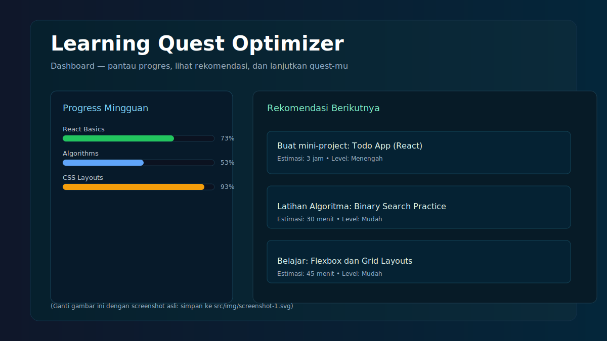
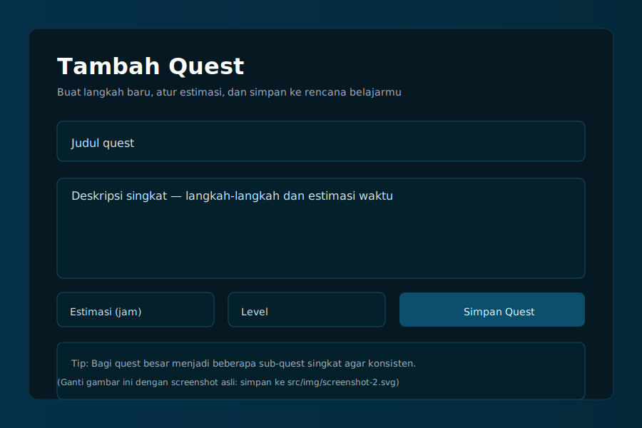

**Learning Quest Optimizer**

Sebuah aplikasi web interaktif untuk merencanakan dan mengoptimalkan perjalanan belajar melalui "quests" yang terstruktur dan menyenangkan.

**Ringkasan Proyek:**
- **Tujuan:** Membantu pelajar membuat rencana belajar bertahap (quest) yang terukur dan adaptif.
- **Stack:** Vite + React + CSS, proyek ringan untuk demonstrasi UX dan logika penjadwalan.

**Fitur Utama:**
- **Quest Builder:** Buat dan susun tugas belajar bertingkat.
- **Progress Tracker:** Lihat progres harian/weekly secara visual.
- **Rekomendasi:** Saran langkah berikutnya berdasarkan performa.

**Cara Menjalankan (lokal):**

1. Install dependensi:

```
npm install
```

2. Jalankan dev server:

```
npm run dev
```

Buka aplikasi di browser (biasanya http://localhost:5173).

**Screenshot:**

- Tampilan utama: 
- Form tambah quest: 

**Struktur Proyek Singkat:**
- **src/**: kode sumber React
- **src/img/**: assets gambar dan screenshot
- **index.html**: entry point

**Menggantikan Screenshot dengan SS Asli:**
- Ambil screenshot dari browser setelah menjalankan aplikasi.
- Simpan file ke `src/img/` dengan nama `screenshot-1.svg` atau `screenshot-2.svg` (atau ganti ekstensi ke .png).

**Kontribusi:**
- Ingin membantu? Buka issue atau kirim PR. Ikuti gaya kode dan tambahkan test sederhana.

**Lisensi:**
- MIT — bebas digunakan dan dimodifikasi.

**Kontak:**
- Pembuat: Learning Quest Optimizer team
