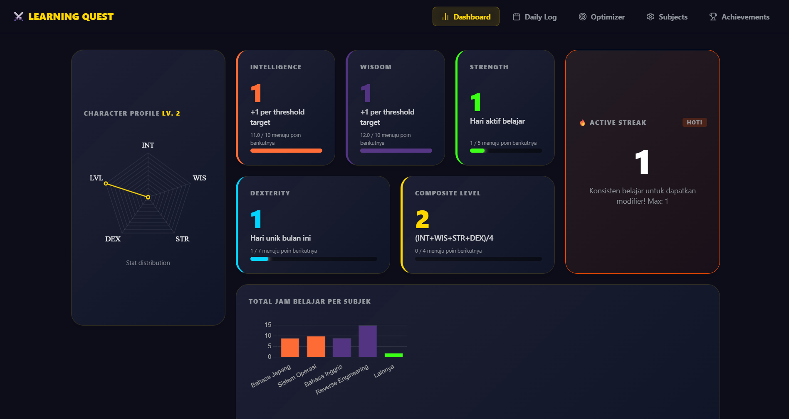
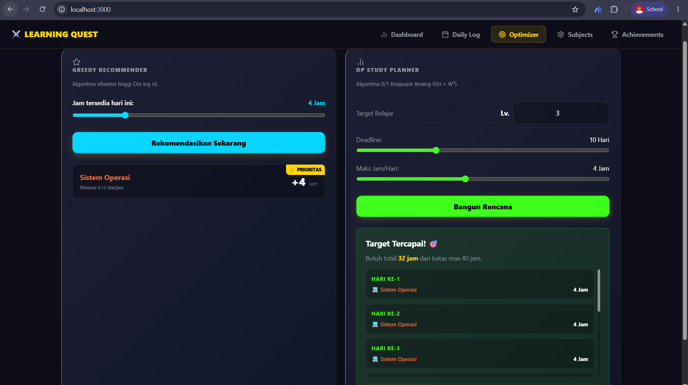

**Learning Quest Optimizer**

Sebuah aplikasi web interaktif untuk merencanakan dan mengoptimalkan perjalanan belajar melalui "quests" yang terstruktur dan menyenangkan.

**Ringkasan Proyek:**
- **Tujuan:** Membantu pelajar membuat rencana belajar bertahap (quest) yang terukur dan adaptif.
- **Stack:** Vite + React + CSS, proyek ringan untuk demonstrasi UX dan logika penjadwalan.
- **Bahasa & Teknologi:** JavaScript (ES6+), React (JSX), HTML5, CSS3, Node.js/npm, Vite

**Fitur Utama:**
- **Quest Builder:** Buat dan susun tugas belajar bertingkat.
- **Progress Tracker:** Lihat progres harian/weekly secara visual.
- **Rekomendasi:** Saran langkah berikutnya berdasarkan performa.

**Cara Menjalankan (lokal):**

1. Install dependensi:

```
npm install
```

2. Jalankan dev server:

```
npm run dev
```

Buka aplikasi di browser (biasanya http://localhost:5173/).

**Screenshot:**

- Tampilan utama: 
- Form tambah quest: 

**Konsep Program:**
Learning Quest Optimizer adalah aplikasi gamifikasi pembelajaran yang dirancang untuk meningkatkan motivasi belajar. Setiap kali pengguna menyelesaikan quest (tugas belajar), aplikasi akan:
- Mencatat jam belajar dan menghitung progres.
- **Setiap 10 jam belajar → nambah 1 stat (Skill Point)** yang bisa dialokasikan ke atribut seperti Intelligence, Focus, Endurance, atau Creativity.
- Menampilkan visual progres level dan achievement badges.
- Memberikan rekomendasi quest berikutnya berdasarkan performa dan waktu kosong.

Dengan sistem ini, belajar menjadi lebih menyenangkan dan terukur — setiap progress langsung terlihat di dashboard.

**Struktur Proyek:**
- **index.html**: entry point HTML
- **src/**: kode sumber React
  - **main.jsx**: entry point React (render App.jsx ke DOM)
  - **App.jsx**: komponen utama aplikasi
  - **index.css**: styling global
- **src/img/**: assets gambar dan screenshot

**Kontribusi:**
- Ingin membantu? Buka issue atau kirim PR. Ikuti gaya kode dan tambahkan test sederhana.

**Lisensi:**
- MIT — bebas digunakan dan dimodifikasi.

**Kontak:**
- Pembuat: andhikaswitch
